Kembali ke [Praktikum Persamaan Diferensial Parsial](./pdp2025genap.qmd)

# Persamaan Gelombang

Persamaan Gelombang pada satu dimensi memilik bentuk umum
$$
\begin{gather*}
  \frac{\partial^2 u}{\partial t^2}(x, t) - \alpha^2\frac{\partial^2 u}{\partial x^2}(x, t) = 0,\\
  0 < x < l,\hspace{1 cm} t> 0.
\end{gather*}
$$
terhadap kondisi batas
$$
\begin{gather*}
  u(0, t) = u(l,t) = 0, \; \text{untuk } t>0,\\
  u(x,0) = f(x),\, \text{ dan } \frac{\partial u}{\partial t}(x, 0),\; \text{ untuk } 0\leq x\leq l,
\end{gather*}
$$
**Catatan:** Kondisi batas dapat berubah bergantung kebutuhan.

Sama seperti bagian sebelumnya, demi kemudahan perhitungan dapat ditulis bentuk lain dari persamaan dalam bentuk
$$
\begin{gather*}
  \frac{\partial^2 u}{\partial t^2}(x, t) - \alpha^2\frac{\partial^2 u}{\partial x^2} = 0, \; \text{xb}< x < \text{xu},\; \text{tb}< t < \text{tu},\\
  u(x, 0) = f(x),\; \frac{\partial u}{\partial t}(x, 0) = g(x),\; \text{xb} < x < \text{xu},\\
  u(0, t) = \text{lb}(t) = 0,\; \text{tb} < t \leq \text{tu}\\
  u(l, t) = \text{rb}(t) = 0,\; \text{tb} < t \leq \text{tu}
\end{gather*}
$$

- *Step size* dalam variabel $x$ dapat ditulis sebagai $h = \Delta x = l/m$, dengan $m$ adalah bilangan bulat positif yang menyatakan banyaknya titik diskritisasi pada panjang interval domain $l$.

- *Step size* dalam variabel $t$ dapat ditulis sebagai $k = \Delta t = T/n$, dengan $n$ adalah bilangan bulat positif yang banyaknya titik diskritisasi pada panjang interval waktu $T$.

## Skema Beda Hingga

Dengan menggunakan skema *centered difference* kita akan memperoleh bentuk persamaan beda hingga dalam bentuk
$$
\frac{ w_{i, j+1} - 2w_{1, j} + w_{i, j} }{ k^2 } -\alpha^2\frac{ w_{i+1,j} -2w_{i,j} + w_{i-1, j} }{ h^2 } = 0
$$

dengan $k$ adalah *step-size* waktu dan $h$ adalah *step-size* untuk $x$. Lakukan pemisalan $\lambda = \alpha k/h$ maka akan diperoleh bentuk lain persamaan beda hingga yaitu
$$
w_{i, j+1} = 2\left(1 - \lambda^2\right)w_{i,j} + \lambda^2\left(w_{i+1, j} + w_{i-1,j}\right) w_{i, j-1}.
$$ 

Lebih lanjut lagi, berdasarkan kondisi batas yang diberikan sebelumnya kita akan memperoleh 
$$
w_{0, j} = w_{m,j}=0,\; \text{ untuk setiap } j = 1, 2, 3\ldots
$$

serta dari nilai awal pertama dapat diperoleh dari
$$
w_{i, 0} = f(x_i), ;\text{ untuk setiap } i = 1, 2, \ldots, m - 1.
$$

Persamaan di atas dapat ditulis sebagai suatu perkalian matriks iteratif yaitu


Perhatikan bahwa hanya ada satu nilai awal yang kita peroleh di sini, namun pada matriks diperlukan satu lagi nilai awal. Untuk itu kita dapat memanfaatkan $g(x)$ yang kita ketahui dari sistem kita. Menggunakan aproksimasi polinomial Maclaurin kita peroleh bahwa 

$$
w_{i,1} = \left(1 - \lambda^2\right)f(x_i) + \frac{\lambda^2}{2}\left(f(x_{i+1}) + f(x_{x-1})\right) + kg(x_i)
$$

## Kode dan Contoh

::: {.panel-tabset}
### *Function file* `hiperbolik_matriks.m` - nama *file* harus sama dengan nama fungsi.

```octave
function [x, t, w] = hiperbolik_matriks(alph2, f, g, lb, rb, xb, xu, tb, tu, h, k)
  x = xb : h : xu;
  t = tb : k : tu;
  m_grid = length(x);
  n_grid = length(t);
  w = zeros(m_grid, n_grid);

  % tetapkan nilai lambda
  lambd2 = (alph2 * k^2) / (h^2);

  % memasang nilai awal (j=1)
  for i = 1 : m_grid
    w(i, 1) = f(x(i));
  endfor

  % memasang syarat batas
  for j = 2 : n_grid
    w(1, j)         = lb(t(j));
    w(m_grid, j)  = rb(t(j));
  endfor

  % aproksimasi Maclaurin
  for i = 2 : (m_grid - 1)
    % jumlahkan secara bertahap
    w(i, 2) = (1 - lambd2) * f((x(i)));
    w(i, 2) += (lambd2 / 2) * (f(x(i+1)) + f(x(i-1)));
    w(i, 2) += k * g(x(i));
  endfor

  % susun matriks A
  A = zeros(m_grid - 2, m_grid - 2);
  for i = 1 : (m_grid - 2)
    % isi sebelah kiri/bawah diagonal
    if (i > 1)
      A(i, i-1) = lambd2;
    endif

    % isi diagonal
    A(i, i) = 2 * (1 - lambd2);

    % isi sebelah kanan/atas diagonal
    if (i < m_grid - 2)
      A(i, i+1) = lambd2;
    endif
  endfor

  % isi nilai di sisanya yaitu j=3, ..., N+1
  for j = 3 : n_grid
    % pengurangan secara bertahap
    w(2 : m_grid - 1, j) = A * w(2 : m_grid - 1, j-1);
    w(2 : m_grid - 1, j) -= w(2 : m_grid - 1, j-2);
  endfor
endfunction
```
:::

### Contoh 1
Diberikan persamaan gelombang berikut, 
$$
\begin{gather*}
  \frac{\partial^2 u}{\partial t^2} - \frac{\partial^2 u}{\partial x^2} = 0,\; 0 < x < l,\;  < t < T,
\end{gather*}
$$
dengan nilai awal dan kecepatan awal
$$
u(x, 0) = \sin \pi x,\; \frac{\partial u}{\partial t}(x, 0) = 0,\; 0\leq x \leq 1
$$
serta syarat batas
$$
u(0, t) = u(l, t) = 0,\; t > 0,
$$ 
dengan juga diberikan *step size* dari $t$ dan $x$ adalah 4 dan waktu maksimumnya adalah 1. Bandingkan hasilnya dengan solusi eksak 
$$
u(x, t) = \cos (\pi t) \sin (\pi t).
$$

::: {.panel-tabset}
### *Script file* `coba1_hiperbolik_matriks.m` - nama file bebas

```octave
% tetapkan parameter algoritma
alph2 = 1;
f = @(x) sin(pi * x);
g = @(x) 0;
lb = @(t) 0;
rb = @(t) 0;
xb = 0;
xu = 1;
tb = 0;
tu = 1; % T
m = 4;
N = 4;
h = (xu - xb)/m;
k = (tu - tb)/N;
% Pastikan syarat kestabilan numerik terpenuhi, yaitu alpha * k / h <= 1.

% simpan output fungsi
[x_arr, t_arr, w] = hiperbolik_matriks(alph2, f, g, lb, rb, xb, xu, tb, tu, h, k);

% solusi eksak
sln = @(x,t) cos(pi * t) .* sin(pi * x);
[x_grid, t_grid] = meshgrid(x_arr, t_arr);
u = sln(x_grid, t_grid);

% menampilkan nilai aproksimasi dalam bentuk seperi grid
disp("Grid nilai aproksimasi:");
disp(flipud(w'));

% menampilkan grid solusi eksak
disp("Grid solusi eksak:");
disp(flipud(u));

% perhitungan error
err_grid = abs(w' - u); % absolute error
err_total = sum(sum(err_grid)); % norm L1 (taxicab/Manhattan)
disp("Grid nilai error:");
disp(flipud(err_grid));
disp("Error total (norm L1):");
disp(err_total);

% gambar mesh hasil aproksimasi
figure 1;
mesh(x_arr, t_arr, w');
title("Hasil aproksimasi");
xlabel("x");
ylabel("t");
zlabel("u");

% gambar mesh solusi eksak
figure 2;
mesh(x_arr, t_arr, u);
title("Solusi eksak");
xlabel("x");
ylabel("t");
zlabel("u");

##% opsional: untuk melihat animasi solusi tiap waktu
##figure 3;
##delay = 1.0;
##
##h_eksak = plot(x_arr, u(1, :), 'b--', 'LineWidth', 2);
##hold on;
##h_num = plot(x_arr, w(:, 1), 'r-', 'LineWidth', 1.5);
##hold off;
##
##axis([xb xu -1.5 1.5]);
##xlabel('x');
##ylabel('u(x,t)');
##legend('Solusi Eksak', 'Aproksimasi');
##
##% perbarui data plot
##for n = 1 : length(t_arr)
##    set(h_eksak, 'YData', u(n, :));
##    set(h_num, 'YData', w(:, n));
##    title(sprintf('t = %.2f', t_arr(n)));
##    drawnow;
##    pause(delay);
##endf
```
:::

::: {.columns}

::: {.column width="50%"}
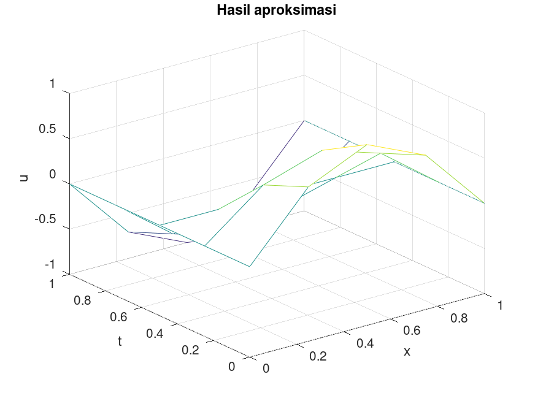{width=100%}
:::

::: {.column width="50%"}
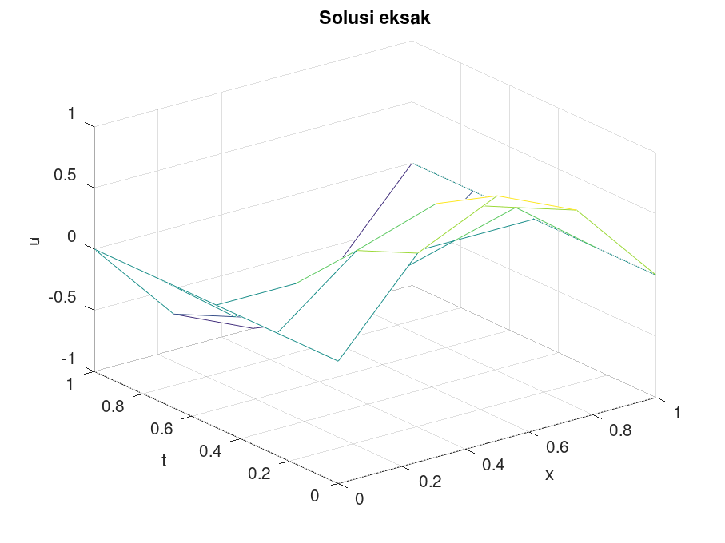{width=100%}
:::

:::

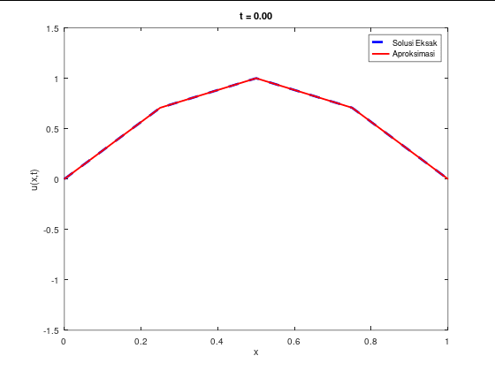{
  width=50%
  fig-align="center"
  style="object-fit: cover; object-position: bottom; height: 290px;"
}

### Contoh 2
Diberikan persamaan gelombang
$$
\begin{align*}
  u_{tt} - \left(0.25\right)^2u_{xx} &= 0, &0 < x < 1,&\; 0 < t < 1,\\
  u(0, t) = u(1, t) &= 0,  &0 < t \leq 1,&\\
  u(x, 0) &= 0,  &0 \leq x \leq 1,&\\
  u_t(x, 0) &= 0,  &0 \leq x \leq 1,&\\
\end{align*}
$$

dengan solusi eksak
$$
\begin{gather*}
  u(x, t) = \sum^\infty_{n=1}c_n \sin \left(0.25n\pi t\right)\sin\left(n \pi x\right),\\
  c_n = \frac{2}{0.25 n \pi}\int^1_0 x\left(1-x\right)\sin\left(n \pi x\right)\;dx,\; n = 1, 2, \ldots 
\end{gather*}
$$ 
yang untuk keperluan komputasi, kita hanya mengambil 10 suku pertama saja dari solusi tersebut. Lakukan simulasi numerik dengan menggunakan *stepsize* $x$ 0.125 dan *stepsize* $t$  0.05.

::: {.panel-tabset}
### *Script file* `coba2_hiperbolik_matriks.m` - nama file bebas

```octave
% tetapkan parameter algoritma
alph2 = 0.25^2;
f = @(x) 0;
g = @(x) x .* (1-x);
lb = @(t) 0;
rb = @(t) 0;
xb = 0;
xu = 1;
tb = 0;
tu = 1;
h = 0.125;
k = 0.05;

[x_arr, t_arr, w] = hiperbolik_matriks(alph2, f, g, lb, rb, xb, xu, tb, tu, h, k);

% solusi eksak dari deret
u = zeros(length(x_arr), length(t_arr));
for i = 1 : length(x_arr)
  for j = 1 : length(t_arr)
    % penjumlahan deret secara bertahap
    u(i,j) = 0;
    for n = 1 : 10
      F = @(x) x .* (1-x) .* sin(n * pi .* x);
      cn = 2/(0.25*n*pi) * integral(F, 0, 1);
      u(i,j) += cn * sin(0.25 * n * pi * t_arr(j)) * sin(n * pi * x_arr(i));
    endfor
  endfor
endfor

% menampilkan nilai aproksimasi dalam bentuk seperi grid
disp("Grid nilai aproksimasi:");
disp(flipud(w'));

% menampilkan grid solusi eksak
disp("Grid solusi eksak:");
disp(flipud(u'));

% perhitungan error
err_grid = abs(w' - u'); % absolute error
err_total = sum(sum(err_grid)); % norm L1 (taxicab/Manhattan)
disp("Grid nilai error:");
disp(flipud(err_grid));
disp("Error total (norm L1):");
disp(err_total);

% gambar mesh hasil aproksimasi
figure 1;
mesh(x_arr, t_arr, w');
title("Hasil aproksimasi");
xlabel("x");
ylabel("t");
zlabel("u");

% gambar mesh solusi eksak
figure 2;
mesh(x_arr, t_arr, u');
title("Solusi eksak");
xlabel("x");
ylabel("t");
zlabel("u");

##% opsional: untuk melihat animasi solusi tiap waktu
##figure 3;
##delay = 1.0;
##
##h_eksak = plot(x_arr, u(:, 1), 'b--', 'LineWidth', 2);
##hold on;
##h_num = plot(x_arr, w(:, 1), 'r-', 'LineWidth', 1.5);
##hold off;
##
##axis([xb xu -1.5 1.5]);
##xlabel('x');
##ylabel('u(x,t)');
##legend('Solusi Eksak', 'Aproksimasi');
##
##% perbarui data plot
##for n = 1 : length(t_arr)
##    set(h_eksak, 'YData', u(:, n));
##    set(h_num, 'YData', w(:, n));
##    title(sprintf('t = %.2f', t_arr(n)));
##    drawnow;
##    pause(delay);
##endfor
```
:::

::: {.columns}

::: {.column width="50%"}
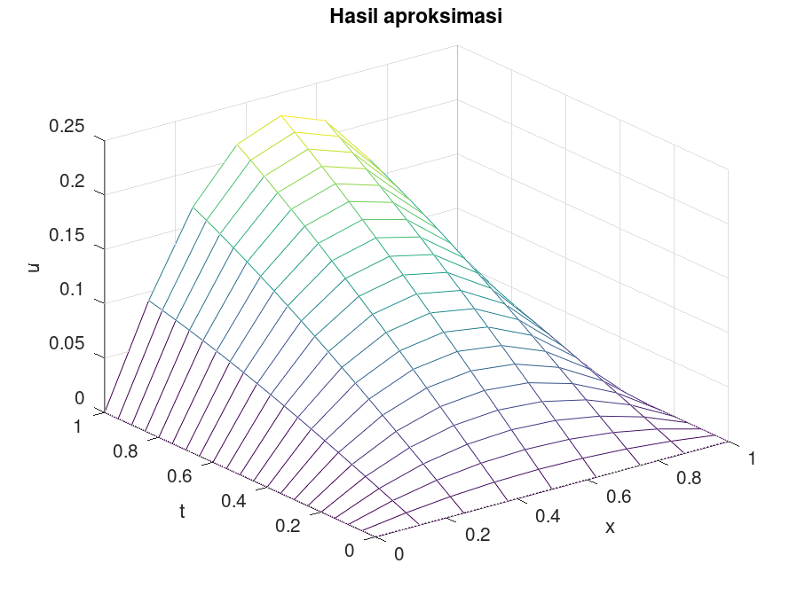{width=100%}
:::

::: {.column width="50%"}
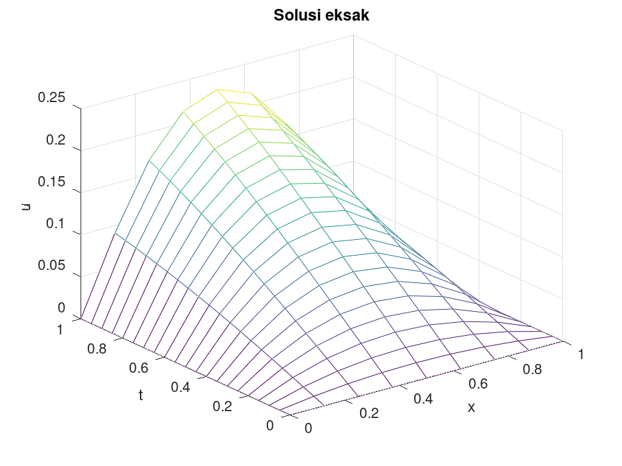{width=100%}
:::

:::

{
  width=50%
  fig-align="center"
  style="object-fit: cover; object-position: bottom; height: 290px;"
}

# Persamaan Panas (Difusi)

Persamaan panas memiliki bentuk umum sebagai berikut.
$$
\begin{gather*}
  \frac{\partial u}{\partial t}(x, t) = \alpha^2\frac{\partial^2 u}{\partial x^2}(x, t),\\
  0 < x < l,\hspace{1 cm} t> 0.
\end{gather*}
$$
terhadap kondisi batas
$$
\begin{gather*}
  u(0, t) = u(l,t) = 0, &\text{ untuk } t>0,\\
  u(x,0) = f(x),  &\text{ untuk } 0\leq x\leq l,
\end{gather*}
$$
**Catatan:** Kondisi batas dapat berubah bergantung kebutuhan.

Persamaan tersebut dapat juga ditulis sebagai 
$$
\begin{gather*}
  \frac{\partial u}{\partial t}(x, t) = \alpha^2\frac{\partial^2 u}{\partial x^2}(x, t) , \; \text{xb}< x < \text{xu},\; \text{tb}< t < \text{tu},\\
  u(x, 0) = f(x),\; \text{xb} < x < \text{xu},\\
  u(0, t) = \text{lb}(t) = 0,\; \text{tb} < t \leq \text{tu}\\
  u(l, t) = \text{rb}(t) = 0,\; \text{tb} < t \leq \text{tu}
\end{gather*}
$$
*Step size* yang digunakan sama persis seperti pada persamaan gelombang sebelumnya.

## Skema *Forward Difference* untuk Persamaan Panas
Skema ini memiliki persamaan beda hingga dalam bentuk
$$
\left(1 - 2 \lambda\right)w_{i,j} - w_{i,j+1} + \lambda \left(w_{i+1,j} + w_{i-1,j}\right) = 0
$$
atau bisa ditulis
$$
w_{i,j+1} = \left(1 - 2 \lambda\right)w_{i,j} + \lambda \left(w_{i+1,j} + w_{i-1,j}\right).
$$

Untuk melakukan perhitungan, kita dapat mengubah bentuk persamaan tersebut menjadi sebuah perkalian matriks yang iteratif.
$$
\mathbf{w}^{j} = A\mathbf{w}^{j-1}
$$
dengan
$$
A = \begin{bmatrix}
    (1-2\lambda) & \lambda & 0 & \cdots & 0 \\
    \lambda & (1-2\lambda) & \lambda & \ddots & \vdots \\
    0 & \lambda & (1-2\lambda) & \ddots & 0 \\
    \vdots & \ddots & \ddots & \ddots & \lambda \\
    0 & \cdots & 0 & \lambda & (1-2\lambda)
\end{bmatrix}
$$

$$
\mathbf{w}^{j} = \begin{bmatrix}
    w_{1,j} & w_{3, j} & \cdots & w_{m-1,j}
\end{bmatrix}^T
$$

Ingat juga bahwa sama seperti sebelumnya kita menetapkan nilai awal 

$$
\mathbf{w}^{0} = \begin{bmatrix}
    f(x_1) & f(x_2) & \cdots & f(x_{m-1})
\end{bmatrix}^T
$$

dan kondisi batas

$$
\begin{gather*}
  w_{0, j} = w(m, j) = 0
\end{gather*}
$$

sepanjang iterasi. Perlu dicatat pula bahwa metode ini akan stabil secara numerik jika memenuhi syarat 

$$
\mathbf{\alpha^2 \frac{k}{h^2} \leq \frac{1}{2}}.
$$

### Kode dan Contoh

#### *Function file* beda hingga langsung

*Function file* `parabolik_forward_fd.m` - nama *file* harus sama dengan nama fungsi.

```octave
function [x, t, w] = parabolik_forward_fd(alph2, f, lb, rb, xb, xu, tb, tu, h, k)
  x = xb : h : xu;
  t = tb : k : tu;
  m_plus_1 = length(x);
  N_plus_1 = length(t);
  w = zeros(m_plus_1, N_plus_1);

  lambd = (alph2 * k) / h^2;

  % memasang nilai awal
  for i = 1 : m_plus_1
    w(i, 1) = f(x(i));
  endfor

  % memasang syarat batas
  for j = 2 : N_plus_1
    w(1, j)         = lb(t(j));
    w(m_plus_1, j)  = rb(t(j));
  endfor

  % menggunakan perumusan finite difference untuk mengisi sisanya
  for j = 1 : (N_plus_1 - 1)
    for i = 2 : (m_plus_1 - 1)
      w(i, j+1) = (1 - 2 * lambd) * w(i, j) + lambd * (w(i+1, j) + w(i-1, j));
    endfor
  endfor
endfunction
```

#### *Function file* dengan matriks

*Function file* `parabolik_forward_matriks.m` - nama *file* harus sama dengan nama fungsi.

```octave
function [x, t, w] = parabolik_forward_matriks(alph2, f, lb, rb, xb, xu, tb, tu, h, k)
  x = xb : h : xu;
  t = tb : k : tu;
  m_plus_1 = length(x);
  N_plus_1 = length(t);
  w = zeros(m_plus_1, N_plus_1);

  lambd = (alph2 * k) / h^2;

  % memasang nilai awal
  for i = 1 : m_plus_1
    w(i, 1) = f(x(i));
  endfor

  % memasang syarat batas
  for j = 2 : N_plus_1
    w(1, j)         = lb(t(j));
    w(m_plus_1, j)  = rb(t(j));
  endfor

  % menyusun matriks A
  A = zeros(m_plus_1 - 2, m_plus_1 - 2); % isi dulu dengan nol semua
  for i = 1 : (m_plus_1 - 2) % untuk tiap baris ke-i
    % isi sebelah kiri/bawah diagonal (kecuali baris pertama)
    if (i > 1)
      A(i, i-1) = lambd;
    endif

    % isi diagonal
    A(i, i) = 1 - 2 * lambd;

    % isi sebelah kanan/atas diagonal (kecuali baris terakhir)
    if (i < m_plus_1 - 2)
      A(i, i+1) = lambd;
    endif
  endfor

  % perkalian matriks untuk mengisi semua nilai lainnya
  for j = 2 : N_plus_1 % untuk tiap waktu ke-j selain nilai awal
    w(2 : m_plus_1 - 1, j) = A * w(2 : m_plus_1 - 1, j-1);
  endfor
endfunction
```

#### Contoh 1

Diberikan persamaan panas
$$
\begin{align*}
  u_t - u_{xx} &= 0, &0 < x < 1, t > 0,\\
  u(0, t) &= u(1, t) = 0, &t\geq 0,\\
  u(x, 0) &= 10x^3(1-x), &0 \leq x \leq 1.
\end{align*}
$$

Solusi eksak dari persamaan tersebut adalah
$$
\begin{align*}
  u(x, t) &= \sum^\infty_{n = 1} c_ne^{-n^2\pi^2t}\sin\left( n\pi x \right),\\
  c_n &= 20\int^1_00 x^3\left( 1-x \right)\sin\left( n \pi x \right)\;dx,\; n = 1, 2, \ldots
\end{align*}
$$

di mana untuk keperluan komputasi, hanya akan digunakan 10 suku pertama dari solusi eksak tersebut. Pada contoh ini akan digunakan $h = 0.2$ dan $k = 0.02$.

*Script file* `coba1_parabolik.m` - nama file bebas

```octave
% tetapkan parameter algoritma
alph2 = 1;
f = @(x) 10 * x .^ 3 .* (1 - x);
lb = @(t) 0;
rb = @(t) 0;
xb = 0;
xu = 1;
tb = 0;
tu = 1;
h = 0.2;
k = 0.02;

[x, t, w] = parabolik_forward_fd(alph2, f, lb, rb, xb, xu, tb, tu, h, k);
% [x, t, w] = parabolik_forward_matriks(alph2, f, lb, rb, xb, xu, tb, tu, h, k);

u = zeros(length(x), length(t));
for i = 1 : length(x)
  for j = 1 : length(t)
    u(i, j) = 0;
    for n = 1 : 10
      F = @(x) x .^ 3 .* (1 - x) .* sin(n * pi .* x);
      cn = 20 * integral(F, 0, 1);
      u(i, j) += cn * exp(-n^2 * pi^2 .* t(j)) .* sin(n * pi .* x(i));
    endfor
  endfor
endfor

figure 1;
mesh(x, t, w');
title("Solusi Numerik");
xlabel("x");
ylabel("t");
zlabel("w");

figure 2;
mesh(x, t, u');
title("Solusi Analitik (deret hingga n=10)");
xlabel("x");
ylabel("t");
zlabel("u");

##% opsional: untuk melihat animasi solusi tiap waktu
##figure 3;
##delay = 1.0;
##
##h_eksak = plot(x, u(:, 1), 'b--', 'LineWidth', 2);
##hold on;
##h_num = plot(x, w(:, 1), 'r-', 'LineWidth', 1.5);
##hold off;
##
##axis([xb xu -1.5 1.5]);
##xlabel('x');
##ylabel('u(x,t)');
##legend('Solusi Eksak', 'Aproksimasi');
##
##% perbarui data plot
##for n = 1 : length(t)
##    set(h_eksak, 'YData', u(:, n));
##    set(h_num, 'YData', w(:, n));
##    title(sprintf('t = %.2f', t(n)));
##    drawnow;
##    pause(delay);
##endfor
```

::: {.columns}

::: {.column width="50%"}
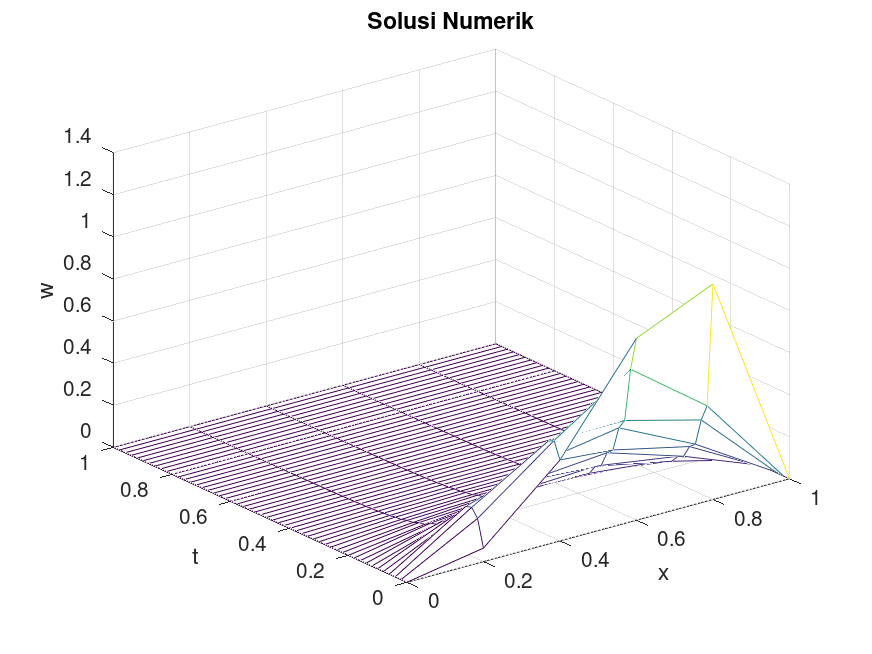{width=100%}
:::

::: {.column width="50%"}
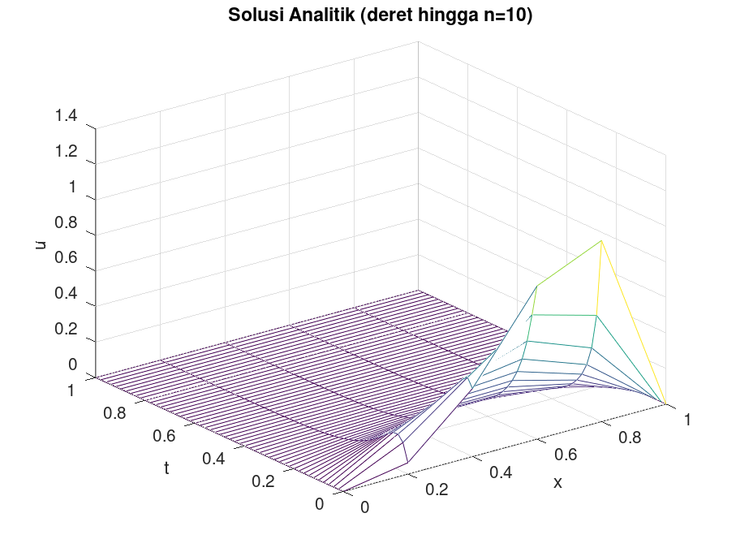{width=100%}
:::

:::

{
  width=50%
  fig-align="center"
  style="object-fit: cover; object-position: bottom; height: 290px;"
}

#### Contoh 2
Diberikan persamaan panas
$$
\begin{align*}
  u_t - u_{xx} &= 0, &0 < x < 1, t > 0,\\
  u(0, t) &= u(1, t) = 0, &t\geq 0,\\
  u(x, 0) &= 10x^3(1-x), &0 \leq x \leq 1.
\end{align*}
$$

Solusi eksak dari persamaan tersebut adalah
$$
\begin{align*}
  u(x, t) &= \sum^\infty_{n = 1} c_ne^{-n^2\pi^2t}\sin\left( n\pi x \right),\\
  c_n &= 20\int^1_00 x^3\left( 1-x \right)\sin\left( n \pi x \right)\;dx,\; n = 1, 2, \ldots
\end{align*}
$$

di mana untuk keperluan komputasi, hanya akan digunakan 10 suku pertama dari solusi eksak tersebut. Pada contoh ini akan digunakan $h = k = 0.2$.

*Script file* `coba2_parabolik.m` - nama file bebas

```octave
% tetapkan parameter algoritma
alph2 = 1;
f = @(x) 10 * x .^ 3 .* (1 - x);
lb = @(t) 0;
rb = @(t) 0;
xb = 0;
xu = 1;
tb = 0;
tu = 1;
h = 0.2;
k = 0.2;

[x, t, w] = parabolik_forward_fd(alph2, f, lb, rb, xb, xu, tb, tu, h, k);
% [x, t, w] = parabolik_forward_matriks(alph2, f, lb, rb, xb, xu, tb, tu, h, k);

u = zeros(length(x), length(t));
for i = 1 : length(x)
  for j = 1 : length(t)
    u(i, j) = 0;
    for n = 1 : 10
      F = @(x) x .^ 3 .* (1 - x) .* sin(n * pi .* x);
      cn = 20 * integral(F, 0, 1);
      u(i, j) += cn * exp(-n^2 * pi^2 .* t(j)) .* sin(n * pi .* x(i));
    endfor
  endfor
endfor

figure 1;
mesh(x, t, w');
title("Solusi Numerik");
xlabel("x");
ylabel("t");
zlabel("w");

figure 2;
mesh(x, t, u');
title("Solusi Analitik (deret hingga n=10)");
xlabel("x");
ylabel("t");
zlabel("u");
```
::: {.columns}

::: {.column width="50%"}
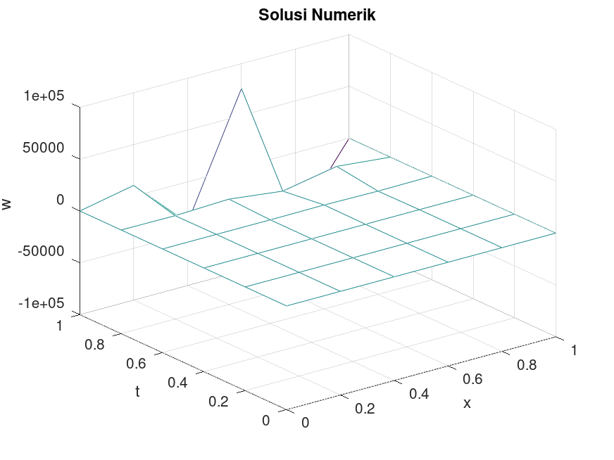{width=100%}
:::

::: {.column width="50%"}
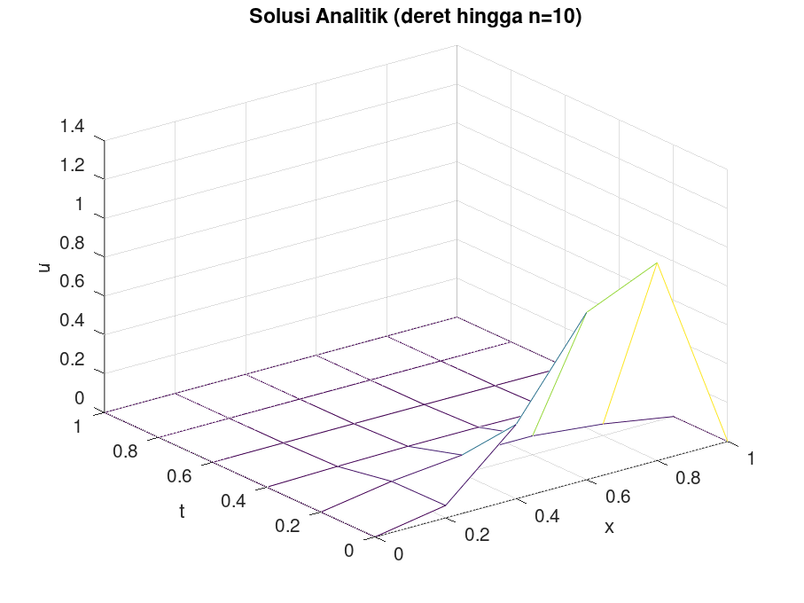{width=100%}
:::

:::

#### Contoh 3
Diberikan persamaan panas
$$
\begin{align*}
    u_t - u_{xx} &= 0, \quad 0 < x < 1, \quad t > 0, \\
    u(0,t) &= u(1,t) = 0, \quad t > 0, \\
    u(x,0) &= \sin \left(\pi x\right), \quad 0 \le x \le 1
\end{align*}
$$

dengan solusi eksak

$$
u(x, t) = e^{-\pi^2t}\sin \left( \pi x \right)
$$

Akan dilakukan simulasi numerik dengan $h = 0.2,\; k = 0.01$, dan $T = 0.5$

*Script file* `coba3_parabolik.m` - nama file bebas

```octave
% tetapkan parameter algoritma
alph2 = 1;
f = @(x) sin(pi * x);
lb = @(t) 0;
rb = @(t) 0;
xb = 0;
xu = 1;
tb = 0;
tu = 0.5; % T
h = 0.2;
k = 0.01;

[x_arr, t_arr, w] = parabolik_forward_fd(alph2, f, lb, rb, xb, xu, tb, tu, h, k);
% [x_arr, t_arr, w] = parabolik_forward_matriks(alph2, f, lb, rb, xb, xu, tb, tu, h, k);


% solusi eksak
u = zeros(length(x_arr), length(t_arr));
sln = @(x, t) exp(-pi^2.*t) * sin(pi.*x);
for i = 1 : length(x_arr)
  for j = 1 : length(t_arr)
    u(i, j) = sln(x_arr(i), t_arr(j));
  endfor
endfor

figure 1;
mesh(x_arr, t_arr, w');
title("Solusi Numerik");
xlabel("x");
ylabel("t");
zlabel("w");

figure 2;
mesh(x_arr, t_arr, u');
title("Solusi Analitik");
xlabel("x");
ylabel("t");
zlabel("u");
```

::: {.columns}

::: {.column width="50%"}
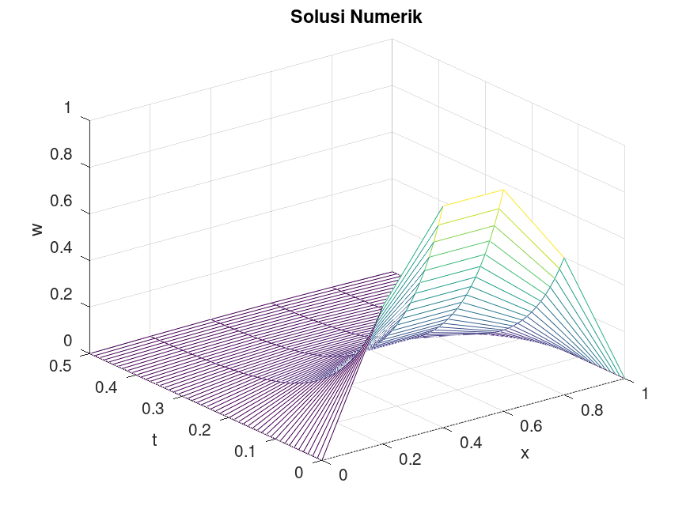{width=100%}
:::

::: {.column width="50%"}
{width=100%}
:::

:::

## Skema *Backward Difference* untuk Persamaan Panas
Skema ini memiliki persamaan beda hingga dalam bentuk
$$
\frac{w_{ij}-w_{i, j-1}}{k}-\alpha^2\frac{w_{i+1, j} - 2w_{ij} + w_{i-1, j}}{h^2} = 0
$$
atau bisa ditulis
$$
\left( 1 + 2\lambda \right)w_{ij} - \lambda w_{i+1, j} - \lambda w_{i-1, j} = w_{i, j-1}.
$$

Maka persamaan tersebut juga sama, dapat disederhanakan menjadi mencari solusi dari perkalian vektor matriks

$$
A\mathbf{w}^j = \mathbf{^{j-1}}
$$

### Kode dan Contoh

#### *Function file* dengan faktorisasi Crout (buku)

*Function file* `parabolik_backward_crout.m` - nama *file* harus sama dengan nama fungsi.

```octave
function [x, t, w] = parabolik_backward_crout(d, f, lb, rb, xb, xu, tb, tu, dx, dt)
  x = xb:dx:xu;
  t = tb:dt:tu;
  nx = length(x);
  nt = length(t);

  % Nilai lambda
  lambd = (d * dt) / (dx^2);

  % Nilai awal dan syarat batas
  for i = 1:nx
    w(i, 1) = f(x(i));
  endfor

  for j = 2:nt
    w(1, j) = lb(t(j));
    w(nx, j) = rb(t(j));
  endfor

  % Penyelesaian SPL dengan faktorisasi Crout
  l(2) = 1 + 2*lambd;
  u(2) = -lambd / l(2);
  for i = 3:nx-2
    l(i) = 1 + 2*lambd + lambd*u(i-1);
    u(i) = -lambd / l(i);
  endfor
  l(nx-1) = 1 + 2*lambd + lambd*u(nx-2);
  for j = 2:nt
    z(2) = w(2, j-1) / l(2);
    for i = 3:nx-1
      z(i) = (w(i, j-1) + lambd*z(i-1)) / l(i);
    endfor
    w(nx-1, j) = z(nx-1);
    for i = nx-2:-1:2
      w(i, j) = z(i) - u(i)*w(i+1, j);
    endfor
  endfor
endfunction
```

#### *Function file* dengan invers matriks langsung

*Function file* `parabolik_backward_langsung.m` - nama *file* harus sama dengan nama fungsi.

```octave
function [x, t, u] = parabolik_backward_langsung(alph2, f, lb, rb, xb, xu, tb, tu, h, k)
  x = xb : h : xu;
  t = tb : k : tu;
  m_plus_1 = length(x);
  N_plus_1 = length(t);
  u = zeros(m_plus_1, N_plus_1);

  lambd = (alph2 * k) / h^2;

  % memasang nilai awal
  for i = 1 : m_plus_1
    u(i, 1) = f(x(i));
  endfor

  % memasang syarat batas
  for j = 2 : N_plus_1
    u(1, j)         = lb(t(j));
    u(m_plus_1, j)  = rb(t(j));
  endfor

  % menyusun matriks A
  A = zeros(m_plus_1 - 2, m_plus_1 - 2);
  for i = 1 : (m_plus_1 - 2)
    % isi sebelah kiri/atas diagonal
    if (i > 1)
      A(i, i-1) = -lambd;
    endif

    % isi diagonal
    A(i, i) = 1 + 2 * lambd;

    % isi sebelah kanan/bawah diagonal
    if (i < m_plus_1 - 2)
      A(i, i+1) = -lambd;
    endif
  endfor

  % mengisi semua nilai lainnya dengan penyelesaian SPL
  for j = 2 : N_plus_1
    u(2 : m_plus_1 - 1, j) = A \ u(2 : m_plus_1 - 1, j-1);
  endfor
endfunction
```

#### Contoh 1
Diberikan persamaan difusi dalam bentuk
$$
\begin{align*}
    u_t - u_{xx} &= 0, \quad 0 < x < 1, \quad t > 0, \\
    u(0,t) &= u(1,t) = 0, \quad t > 0, \\
    u(x,0) &= \sin \left(\pi x\right), \quad 0 \le x \le 1
\end{align*}
$$

dengan solusi eksak
$$
u(x,t) = e^{-\pi^2 t} \sin \left(\pi x\right).
$$
Jika interval waktu dibatas pada $0\leq t \leq 1$ dan menggunakan step size $h = 0.2$ dan $0.2$, maka akan dilakukan simulasi numerik menggunakan metode *Backward Difference*

*Script file* `coba1_parabolik_bd.m` - nama file bebas

```octave
% tetapkan nilai parameter
alph2 = 1;
f = @(x) sin(pi*x);
lb = rb = @(t) 0;
xb = 0;
xu = 1;
tb = 0;
tu = 1;
h = 0.2;
k = 0.2;

[x, t, w] = parabolik_backward_crout(alph2, f, lb, rb, xb, xu, tb, tu, h, k);
% [x, t, w] = parabolik_backward_langsung(alph2, f, lb, rb, xb, xu, tb, tu, h, k);

u = @(x, t) exp(-pi^2.*t) * sin(pi.*x);
for i = 1:length(x)
  for j = 1:length(t)
    ufig(i, j) = u(x(i), t(j));
  endfor
endfor

figure(1);
mesh(x, t, ufig');
xlabel("x");
ylabel("t");
zlabel("u");

figure(2);
mesh(x, t, w');
xlabel("x");
ylabel("t");
zlabel("u");

% opsional: untuk melihat animasi solusi tiap waktu
##figure 3;
##delay = 1.0;
##
##h_eksak = plot(x, ufig(:, 1), 'b--', 'LineWidth', 2);
##hold on;
##h_num = plot(x, w(:, 1), 'r-', 'LineWidth', 1.5);
##hold off;
##
##axis([xb xu -1.5 1.5]);
##xlabel('x');
##ylabel('u(x,t)');
##legend('Solusi Eksak', 'Aproksimasi');
##
##% perbarui data plot
##for n = 1 : length(t)
##    set(h_eksak, 'YData', ufig(:, n));
##    set(h_num, 'YData', w(:, n));
##    title(sprintf('t = %.2f', t(n)));
##    drawnow;
##    pause(delay);
##endfor
```
::: {.columns}

::: {.column width="50%"}
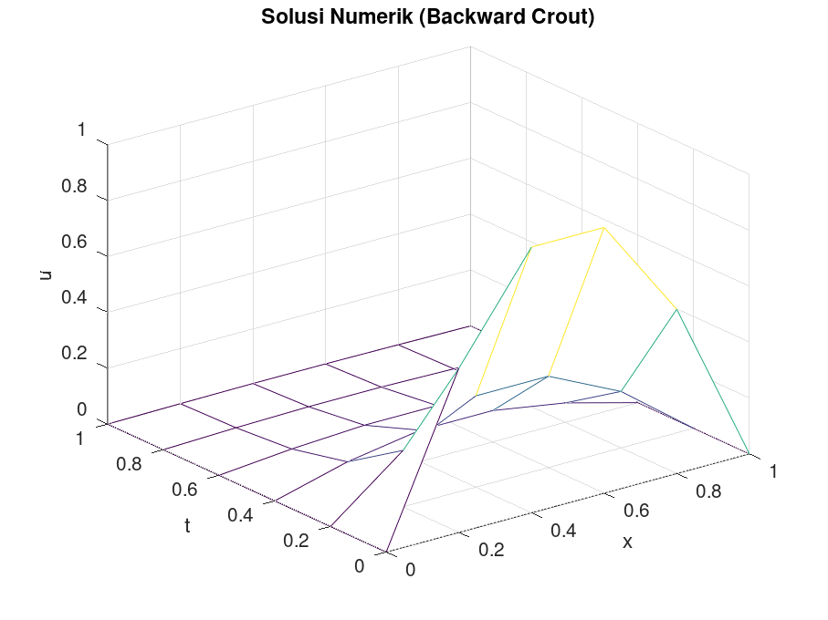{width=100%}
:::

::: {.column width="50%"}
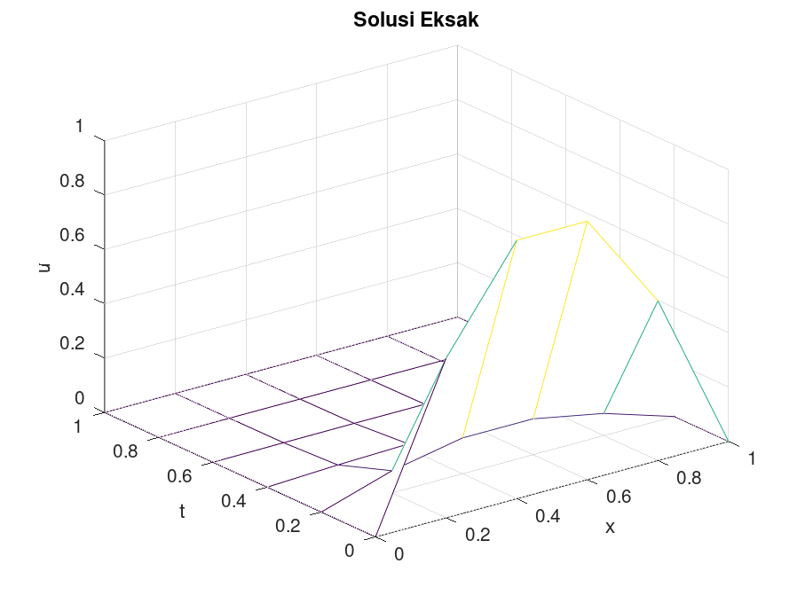{width=100%}
:::

:::

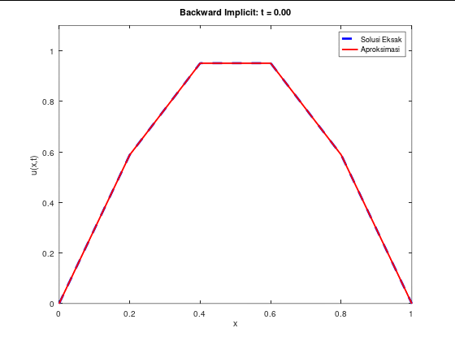{
  width=50%
  fig-align="center"
  style="object-fit: cover; object-position: bottom; height: 290px;"
}

#### Contoh 2
Diberikan persamaan panas
$$
\begin{align*}
    u_t - u_{xx} &= 0, \quad 0 < x < 1, \quad t > 0 \\
    u(0,t) &= u(1,t) = 0, \quad t \le 0 \\
    u(x,0) &= 10x^3(1-x), \quad 0 \le x \le 1 \\
\end{align*}
$$

dengan solusi eksak dalam bentuk deret
$$
\begin{align*}
    u(x,t) &= \sum_{n=1}^{\infty} c_n e^{-n^2 \pi^2 t} \sin \left( n\pi x\right) \\
    c_n &= 20 \int_0^1 x^3 (1-x) \sin \left( n\pi x \right) dx, \quad n = 1, 2, \dots
\end{align*}
$$

yang untuk keperluan komputasi hanya akan diambil 10 suku pertama.

*Script file* `coba2_parabolik_bd.m` - nama file bebas

```octave
alph2 = 1;
f = @(x) 10 * x .^ 3 .* (1 - x);
lb = @(t) 0;
rb = @(t) 0;
xb = 0;
xu = 1;
tb = 0;
tu = 1;
h = 0.2;
k = 0.2;

[x, t, w] = parabolik_backward_langsung(alph2, f, lb, rb, xb, xu, tb, tu, h, k);

u = zeros(length(x), length(t));
for i = 1 : length(x)
  for j = 1 : length(t)
    u(i, j) = 0;
    for n = 1 : 10
      F = @(x) x .^ 3 .* (1 - x) .* sin(n * pi .* x);
      cn = 20 * integral(F, 0, 1);
      u(i, j) += cn * exp(-n^2 * pi^2 .* t(j)) .* sin(n * pi .* x(i));
    endfor
  endfor
endfor

figure 1;
mesh(x, t, w');
title("Solusi Numerik");
xlabel("x");
ylabel("t");
zlabel("w");

figure 2;
mesh(x, t, u');
title("Solusi Analitik (deret hingga n=10)");
xlabel("x");
ylabel("t");
zlabel("u");
```
::: {.columns}

::: {.column width="50%"}
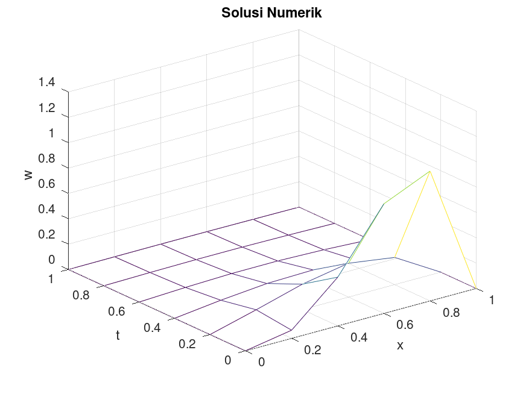{width=100%}
:::

::: {.column width="50%"}
{width=100%}
:::

:::